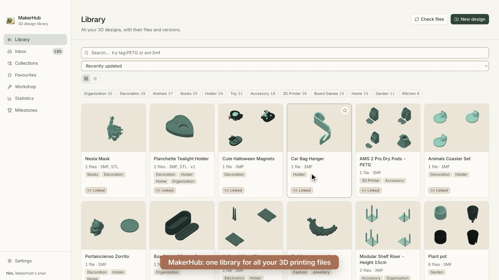

# Demo

A 66-second walkthrough of MakerHub, recorded with my own library. No sound: the captions carry the story.

What it shows: finding one of my own designs (a planchette tealight holder) by tag and by name, its tags, the print settings read from its Bambu Studio project, its versions and print log, turning a new file around in the Inbox (another of my designs, a cat coaster) before keeping it, the statistics view, and switching from light to dark mode.
